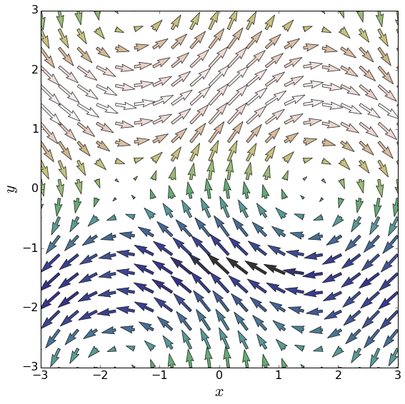

# Plot VTK files using Matplotlib

This library allows to easily plot VTK files, for example, from FEniCS or any
other software, in two dimensions using Matplotlib. The VTK file can be based
on an Unstructured or Structured grid, binary or XML.

By default, the class in this library extracts the data from a slice of the
system, in the x-y plane, thus a range of z values must be specified.

The data extracted from the VTK file is interpolated using SciPy but an option
to use [natgrid](https://github.com/matplotlib/natgrid) is also available.

Currently, there are two functions to plot the data: one to plot a colormap of
the sliced data with an optional quiver plot on top and one to make a quiver
plot of the vector field.

The interpolation is performed in a square grid whose dimensions and spacing
can be tuned. A complete tutorial with most of the capabilities of this library
can be found in the `plot_vtk_matplotlib_tutorial.ipynb` IPython notebook.
This library is mainly oriented to be used with IPython notebooks since we do
not state `matplotlib.pyplot.show()` when generating the graphs, but it can be
specified after the library function calls.

# Installation

Clone the repository and from it, as a root user, do

    pip install .

This will add `plot_vtk_matplotlib` to the Python libraries.

The library needs `matplotlib`, `scipy` and `vtk` to work. It is recommended
to install the latest versions using `pip`.

# License

A BSD license statement can be found in the `license.txt` file. 
